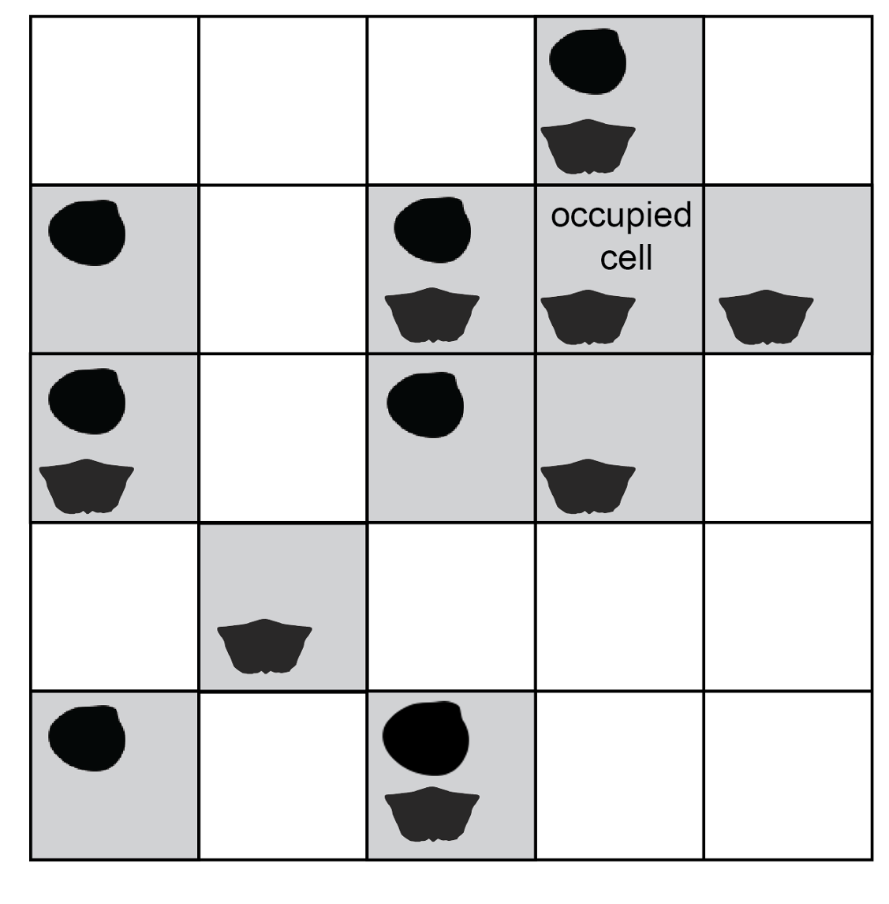
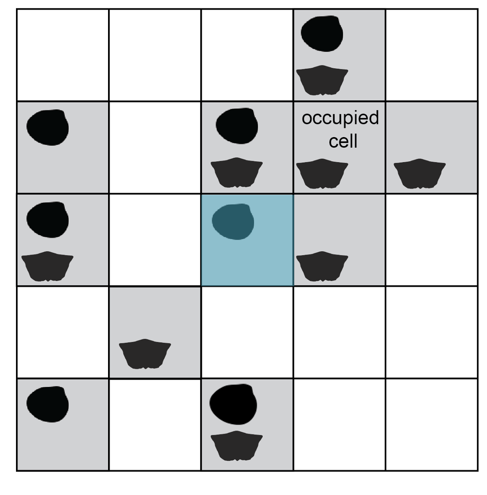
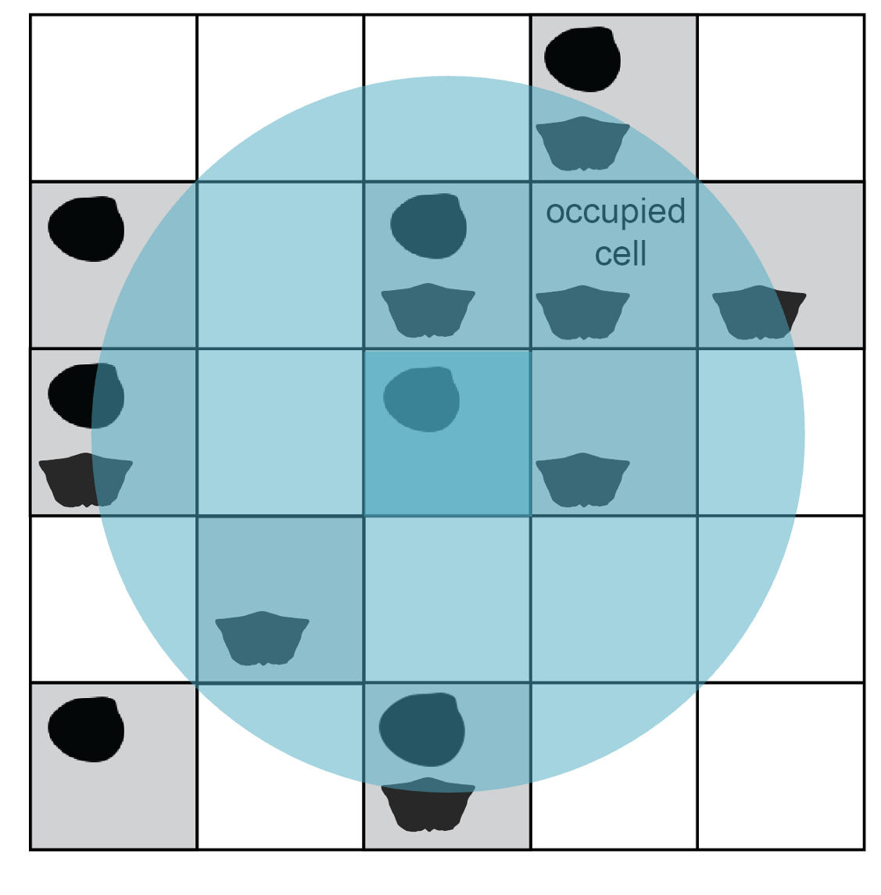
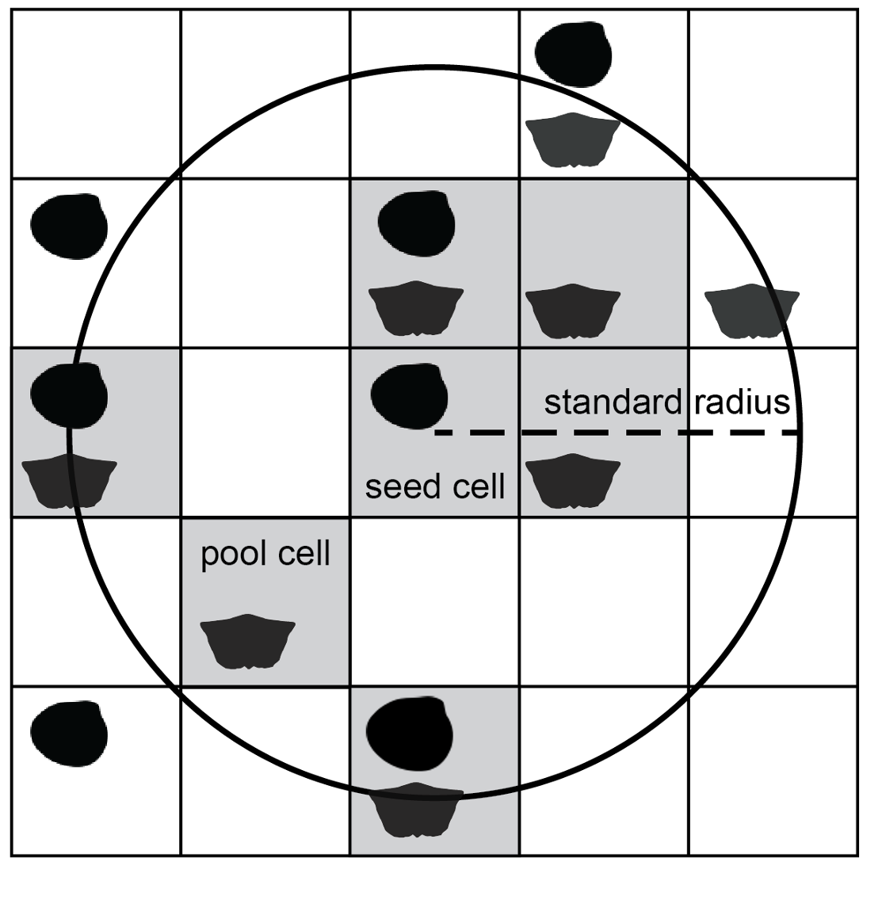
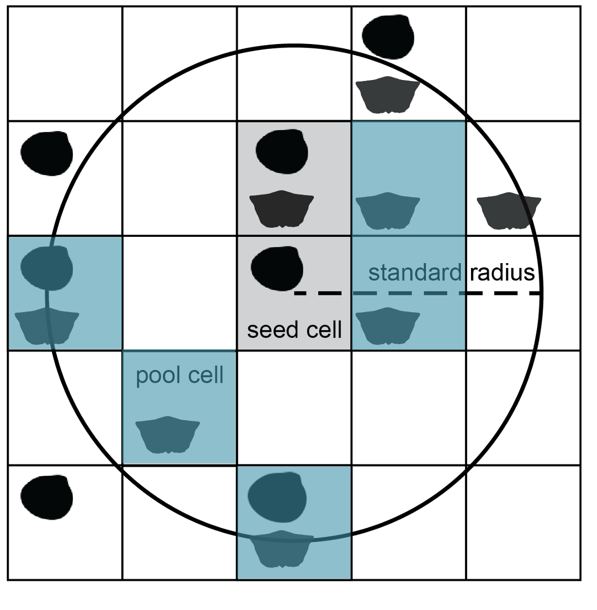
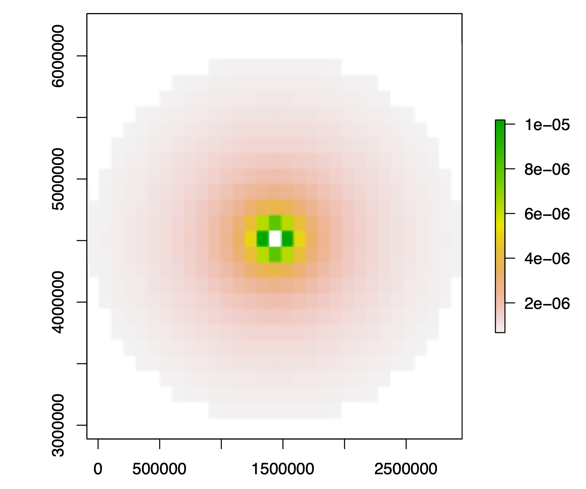
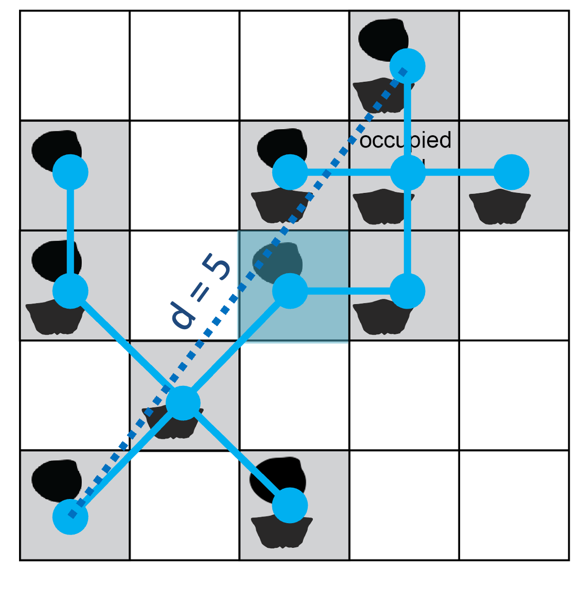
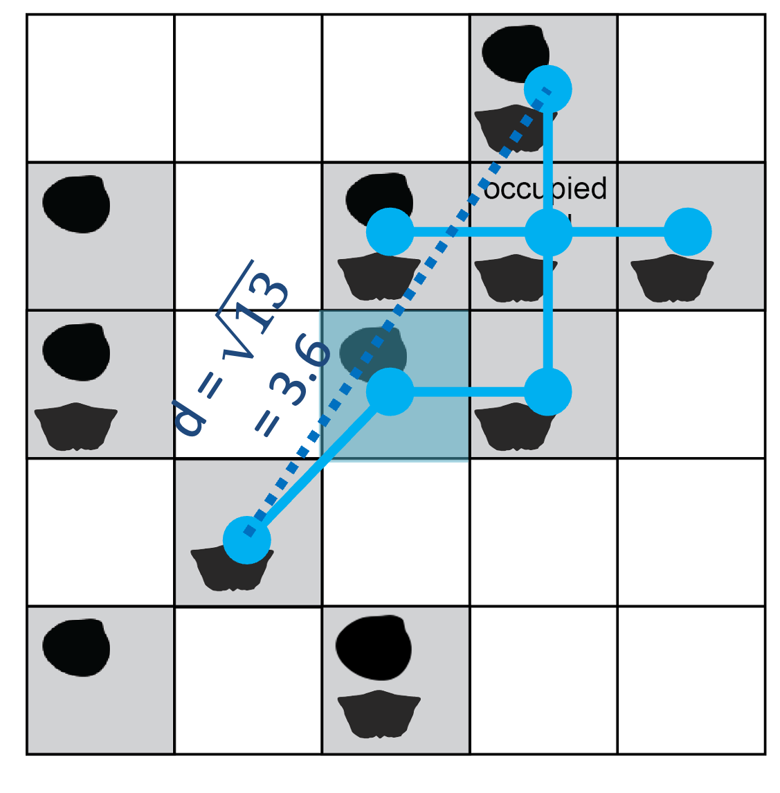
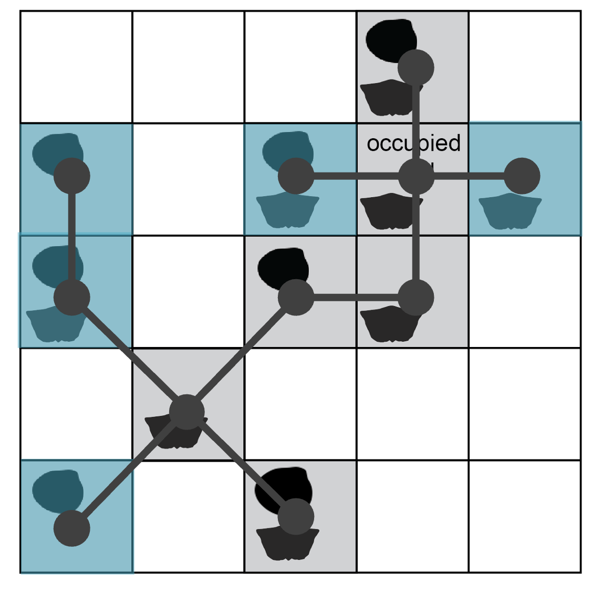

```{r, include = FALSE}
knitr::opts_chunk$set(
  collapse = TRUE,
  comment = "#>"
)
```

## Circular subsampling

The `divvy` package implements circular subsampling with the `cookies()` function, so-named because the routine iteratively cuts equal-area sections out of the sampled world, just as a cookie cutter turns an irregular sheet of dough into a batch of equivalent shapes. The method was developed in @Antell2020.

### Basic procedure

The subsampling function operates on rasterised data, i.e. taxon occurrences allocated to spatial grid cells. Within a cell, a taxon is present or absent; the subsampling routine ignores abundance counts or duplicate occurrences. Cells could be divided by latitude-longitude, e.g. at 1-degree resolution, but subsampling would be fairer if the cells have equal area regardless of latitudinal position. The Equal Earth projection is an example of an equal-area raster system. 

```{r out.width=500, fig.align='center', echo=FALSE, fig.cap='*Occurrences are rasterised to presence-absence values in spatial grid cells. Silhouettes indicate different taxa.*', fig.alt = 'A 5-by-5 grid, with small depictions of a bivalve and brachiopod in some squares to indicate presence points'}

```

The procedure runs iteratively, returning a specified number of subsamples. The process of collecting a single subsample is demonstrated below. First, a single occupied cell is selected at random. This starting cell is the 'seed point'. 

```{r out.width=500, fig.align='center', echo=FALSE, fig.cap='*One occupied cell is drawn as the starting point for a new subsample.*', fig.alt='The cell in the center of the grid, containing one clam occurrence, is highlighted.'}

```

To control the spatial extent of sampling, the seed cell is buffered to a circular area of given radius. This constraint is necessary for any type of diversity analysis because it helps standardise beta diversity, the amount of taxonomic turnover from increasingly distant sites.

```{r out.width=500, fig.align='center', echo=FALSE, fig.cap='*The seed point is buffered by a given radius (here, r = 2 cell-width units) to constraint spatial extent of a subsample.*', fig.alt = 'A circle is overlaid on the grid, centered on the middle grid cell highlighted in the previous step. The circle covers some nearby grid cells completely and some farther cells partially.'}

```

From this step onward, cells are considered for the subsample only if their centroid coordinates fall within the buffer area. Included cells make up the pool for site rarefaction. The encompassing circle is laid down indiscriminately with regard to geography, so the pool size will vary with the amount of sea/land coverage in the region as well as the amount of scientific effort to discover and collect from sites. It is crucial to standardise the total area and number of sites because diversity is tied to sample area through the species--area effect: regions containing more sites will tend to return more taxa regardless of true taxonomic richness.

```{r out.width=500, fig.align='center', echo=FALSE, fig.cap='*Occupied cells with centroid coordinates falling inside the buffer circle make up the pool of available subsample cells and are shaded grey.*', fig.alt = 'The radius of the circle is annotated as 2 grid cells in length. Grid cells with a center falling within the circular area are highlighted: this includes 7 of 11 occupied cells in the grid.'}

```

The final step of subsampling is selection of a given number of cells from the available pool. If cells are equal in area, this step standardises the total spatial area covered by the subsample. Cells are drawn without replacement, so it is possible to obtain a subsample only if there are at least as many occupied cells in the region as the desired site quota. Cells are considered viable as seed points if they lead to site pools of sufficient size; the subsampling function finds and excludes inviable cells *a priori* to draw subsamples efficiently from feasible regions.  

```{r out.width=500, fig.align='center', echo=FALSE, fig.cap='*A given number of cells (blue, n = 5) are drawn randomly, without replacement from the pool of cells in the buffer circle.*', fig.alt = 'Of the 7 cells highlighted in the previous step (all falling mostly within the regional circle), 5 of these occupied cells are shaded to indicate their random selection for a subsample.'}

```

Depending on the argument specified for function output, the procedure returns the coordinates of the subsampled cells (`output = 'locs'`) or the data rows for occurrences contained by those cells (`output = 'full'`). The entire subsampling routine is repeated for a specified number of iterations. A given cell can be selected as seed point multiple times, so it is possible for two or more subsamples to contain identical subsets of cells. In general, occasional duplication is inherent to random subsampling and will be inconsequential for later analysis. However, if the original observations are very limited in number and extent, it may be prudent to expand the radius and/or reduce the required cell quota to reduce the incidence of identical subsamples. To check there are a healthy number of unique site combinations relative to the number of replications, the analyst could compare lists of included sites between subsamples.

### Weighted cell selection

The baseline method of circular subsampling described above selects cells at random within a radial constraint. A modification to the method selects cells probabilistically, with weight inversely proportional to squared distance from the central seed cell. This probabilistic approach clusters cells in the subsample more tightly while avoiding being completely deterministic; effectively, the modification provides an intermediate subsampling strategy between baseline circular and nearest-neighbor subsampling. If occupied cells are sparse, cells at the periphery of the buffer will be drawn to fill the cell quota despite their lower selection probability. The weighted cell subsampling routine was used to generate main-text results in Antell *et al.* (2020), although ultimately the results from unweighted and weighted subsampling were equivalent.


```{r out.width=500, fig.align='center', echo=FALSE, fig.cap='*Cell selection probabilities in weighted subsampling are proportional to the inverse of the squared distance from the center, colored as a heatmap in this example. The seed cell is always included in weighted subsamples.*', fig.alt = 'Cell selection probabilities in weighted subsampling are proportional to the inverse of the squared distance from the center, colored as a heatmap in this example. The seed cell is always included in weighted subsamples.'}

```

## Nearest-neighbor subsampling

The `clustr()` function in `divvy` subsamples sites according to proximity, a procedure adapted from those introduced by Close *et al.* (2017, 2020).

### Basic procedure

The `clustr()` function groups sites together, starting with the closest coordinates to the starting point. As with the cookies function, the clustering routine ignores abundance counts or duplicate occurrences, and the process of generating a subsample begins with random selection of an occupied site as a seed point. 

```{r out.width=500, fig.align='center', echo=FALSE, fig.cap='*One occupied site is drawn as the starting point for a new subsample. Here, sites are rasterised as grid cells.*', fig.alt='The same starting 5-by-5 grid of two species occurrences is shown as for the previous method. The center cell is highlighted.'}

```

The function calculates the distance between the seed point and all other occupied sites. The closest site is linked to the seed (the first branch in a minimum spanning tree connecting subsample sites). The function again (1) calculates the pairwise distances between each point in the included set and all other occupied sites and then (2) adds the nearest neighbor to the set. The site cluster grows deterministically until the maximum diameter across the point set reaches a specified limit. Below is an illustration of the minimum spanning tree connecting all occupied sites in the example region.

```{r out.width=500, fig.align='center', echo=FALSE, fig.cap='*Starting from the seed cell (shaded blue), a minimum spanning tree (solid blue lines) connects the dots of occupied sites. The maximum diameter of this tree is 5 grid-cell units (dashed line).*', fig.alt='A network of lines is drawn over the grid, with the endpoints of each line connecting two nearby, occupied grid cells. All occupied cells are touched by line ends.'}

```

Like the radial constraint in circular subsampling, the cap on cluster diameter attempts to standardise beta diversity (spatial turnover in taxa). Applying a maximum distance of 4 cell-width units (twice the radius used in the above example for cookies), some sites are excluded from the cluster built on this seed point. 

```{r out.width=500, fig.align='center', echo=FALSE, fig.cap='*The maximum distance across the set of included sites is ~3.6; adding any additional occupied site would increase the length above the threshold of 4 cell-width units.*', fig.alt='The network of lines from the previous figure is pruned, such that four occupied cells at the edge of the grid are no longer linked.'}

```

As with circular subsampling, the analyst should experiment with diameter threshold values to choose a spatial bounding extent small enough to capture regional diversity differences but large enough to allow most sites around the world/study area to be gathered into clusters, rather than sit outside them.

The function returns the final cluster coordinates (or the occurrences located thereat, if requested), as one element in the list output. As many subsamples are returned as specified for the number of iterations. Due to the stochastic nature of drawing seed points and the finite number of sites available to aggregate, it is possible for multiple subsamples to contain identical site combinations. Site rarefaction (described below) reduces the incidence of duplicate clusters by further subsampling, but it is possible for the same sites to be drawn by chance, as with circular subsampling. 

The original versions of nearest-neighbor subsampling grouped clusters by continental region and nested analysis within these regions before making global comparisons [@Close2017, @Close2020]. The exact method of cutting trees into continental regions differed between the two papers, but regional assignments were somewhat automated by looking up modern-day country codes associated with occurrence coordinates. These approaches leave decisions for an analyst about how to track bioregions across time and drifting tectonic plates. The `divvy` implementation of nearest-neighbor subsampling is more like bootstrapping, where all subsamples are treated equivalently, irrespective of position; the full set of iterations may be analysed in an automated and simultaneous way.

### Site rarefaction

Original versions of nearest-neighbor subsampling return all sites within a cluster that meets size and completeness specifications [@Close2017, @Close2020]. As noted for circular subsampling above, however, the number of sites can vary widely between clusters of similar extent. On average, more taxa will be observed in clusters that include more sites/area because of the species--area effect. Rarefaction of references or collections (defined in Paleobiology Database data structures) is one strategy to attempt to mitigate differences in spatial coverage within regional subsamples, but the more direct approach is standardising the number of sites within clusters. Site/cell rarefaction is always included under the `cookies()` function, but it is an optional choice with the `clustr()` function, since it was absent in the original published uses. Forgoing site rarefaction increases compatibility with how results were generated in the original published code. Implementing site rarefaction is recommended and improves comparability between circular and nearest-neighbor subsampling routines. In the example below, occupied cells are drawn randomly without replacement from a full cluster to reach a quota of 5 sites in the final subsample.

```{r out.width=500, fig.align='center', echo=FALSE, fig.cap='*The full cluster set (grey dots and lines, diameter = 5 units) is rarefied to a given number of sites (blue shading, n = 5).*', fig.alt='The line network spans all 11 occupied sites in the grid. Five of these sites are shaded in blue; they are scattered across the grid.'}

```

## References
